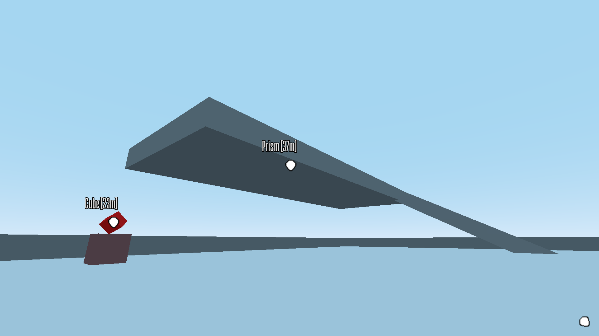

# Spatial Markers

This serves as a small library of scripts to add "Spatial Markers" into Godot projects. Spatial markers are UI elements that track the on-screen position of objects in 3D space.

For example, in the walk around demo (```./demo/walk_around```):

<!--- Embed an image here -->


The intension behind this project is to create a general purpose foundation for this feature, with the scripts located in `./spatial_markers`. Specific implementations of this feature would extend these scripts, with examples of these in the `./demo` directory.

The project is still in it's early stages and is therefore unstable and subject to compatibility breaking changes.
